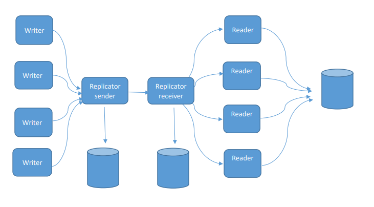

# Projektni zadatak 4 - Replikator
## Dokumentacija

---

---

Sistem koji implementira Replikator modul sastoji se od pet komponenti: [Writer](#writer), [Sender](#sender), [Receiver](#receiver), [Reader](#reader) i [Logger](#logger).

U daljem tekstu biće opisan sam zadatak, kao i svaka od komponenti pojedinačno. Instrukcije za pokretanje zadatka možete pogledati u odeljku [Pokretanje](#pokretanje)

---

## Writer

Writer predstavlja ulaznu tačku implementiranog sistema. Korisniku je pomoću Writer Handler aplikacije omogućeno kreiranje novih instanci Writera (komanda "open"), brisanje jedne od postojećih (komanda "choose"), kao i brisanje poslednje kreirane instance (komanda "close"). Nakon pokretanja instance komponenta će u beskonačnoj petlji generisati celobrojnu vrednost u opsegu 0 do 9 i jedan od kodova iz ponuđene liste. Ove dve vrednosti se pakuju i nakon ostvarene konekcije šalju na sledeću komponentu - Replicator Sender.

---

## Sender

Replicator Sender komponenta je odredište na koje svi postojeći Writeri šalju svoje pakete. Nakon primanja jednog takvog paketa Sender će ga sačuvati u sopstveni buffer. Ako je upostavljena konekcija sa Replicator Receiver komponentom podaci iz buffer-a će biti prosleđeni na dalju obradu.

---

## Receiver

Replicator Receiver implementira glavnu logiku zadatka. Nakon primanja celobrojne vrednosti i koda od Sender komponente, Receiver će podatke prepakovati u svoju internu strukturu podataka - Collection Description. Ovako prepakovani podaci će biti čuvani u kolekcijama iz DeltaCD klase - "add" i "update". Nakon što Receiver primi ukupno 10 paketa, podaci iz ovih kolekcija će biti poslati određenom Readeru, u zavisnosti od Dataseta izračunatog prema kodu, a same kolekcije će biti ispražnjene.

---

## Reader

Reader je komponenta koja preko DatabaseHandler klase upravlja bazom podataka. Postoje ukupno 4 instance Readera koje rade sa specifičnim Datasetom, označenim vrednošću od 1 do 4, te postoje i četiri datoteke koje predstavljaju baze podataka. Paketi koji su pristigli iz Receivera se raspakuju, a iz baze podataka se zahteva entitet sa prosleđenim ID-em. Ukoliko takav entitet postoji i samo ukoliko su uslovi za upis ispunjeni (kod je jednak "CODE_DIGITAL" ili se nova vrednost razlikuje za više od 2% od postojeće) entitet iz baze će biti prepisan novim vrednostima. U slučaju da entitet sa ID-em ne postoji u bazi on će biti upisan bez proveravanja navedenih uslova. 

---

## Logger

Logger komponenta služi za beleženje svih važnih aktivnosti u sistemu. Svako slanje i primanje koje se dešava u Writeru, Senderu, Receiveru ili Readeru biće prosleđeno ovoj komponenti koja će iste čuvati u tekstualnu datoteku.

---

## Pokretanje:

Redosled pokretanja komponenti:

1. /logger/logger.py
2. /reader
    - /reader_1.py
    - /reader_2.py
    - /reader_3.py
    - /reader_4.py
3. /receiver/replicator_receiver.py
4. /sender/replicator_sender.py
5. /writer/handler.py

---
